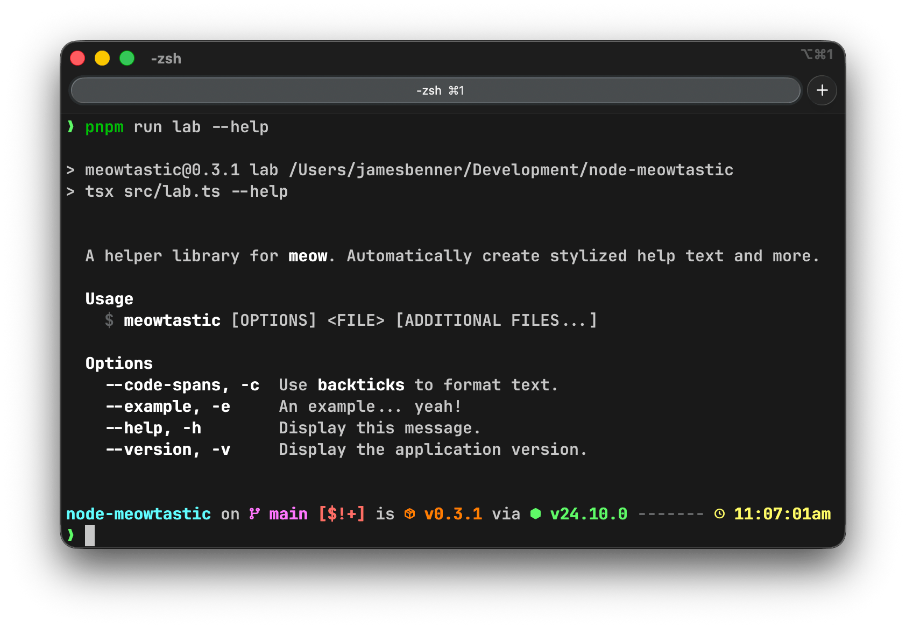

meowtastic
==========

A helper library for [meow](https://www.npmjs.com/package/meow). Automatically create stylized help
text and more.





Install
-------

...

Usage
-----

```typescript
import meow from 'meow';
import {
  type AnyFlagsWithDescriptions,
  type Config,
  getHelpAndVersionFlags,
  getHelpText
} from 'meowtastic';

const flags: AnyFlagsWithDescriptions = {
  ...getHelpAndVersionFlags(), // <- Add a description and short flag for `help` and `version`.
  yolo: {
    description: 'Do something or invoke `yolo` or something else... Invoke `idk`?',
    type: 'boolean',
    shortFlag: 'y'
  }
};

const config: Config = {
  flags,
  importMeta: import.meta,
  includeDescription: true,
  packageOverride: {
    bin: { meowtastic: 'path/to/bin' }
  }
};

meow(
  getHelpText(config),
  {
    description: false,
    flags,
    importMeta: import.meta
  }
);
```

Prior Art
---------

- [cli-meow-help](https://www.npmjs.com/package/cli-meow-help)
- [meow-helper](https://www.npmjs.com/package/meow-helper)

License
-------

The BSD 3-Clause License. See the [license file](LICENSE) for details.
