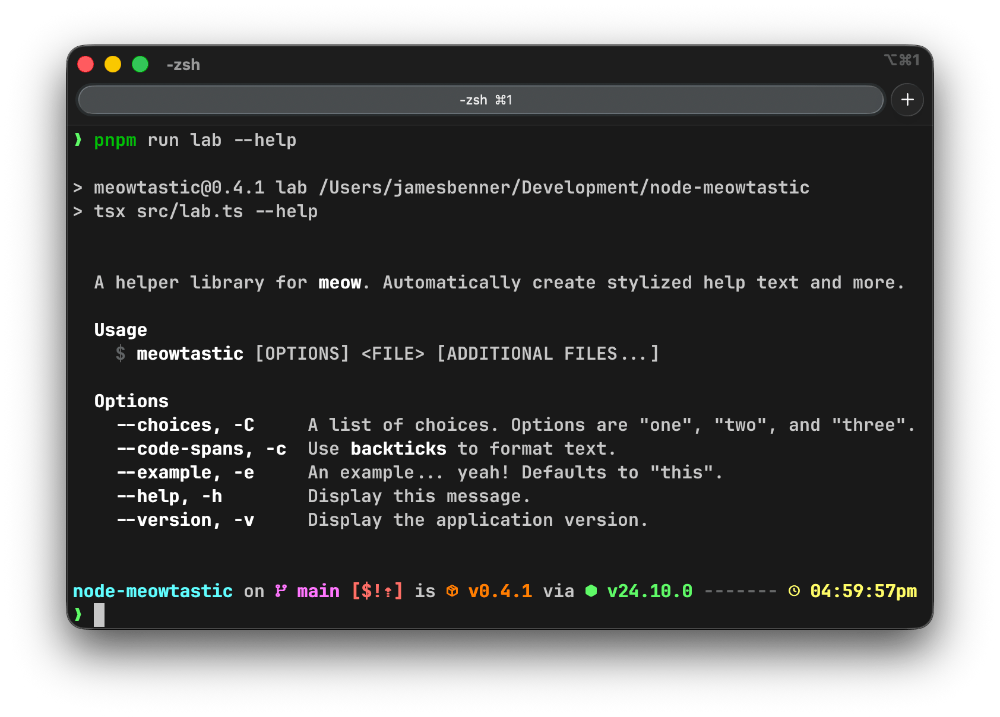

meowtastic
==========

A helper library for [meow](https://www.npmjs.com/package/meow). Automatically create stylized help
text and more.



Features
--------

- Automatically styles Markdown code spans.
- Displays a usage example which can be customized.
- Lists all available flags in alphabetical order. Displays descriptions as well if specified.
- Is easily themeable.
- Provides optional descriptions and short flags for the `help` and `version` flags.
- Supports the [`NO_COLOR`](https://no-color.org/) environment variable standard.
- Wraps help text at 80 columns by default, although this can be disabled.

Install
-------

```shell
npm install meowtastic
```

Usage
-----

```typescript
import meow from 'meow';
import { type Config, getHelpTextAndOptions } from 'meowtastic';

const config: Config = {
  arguments: [
    { name: 'file', isRequired: true },
    { name: 'additional files...' }
  ],
  flags: {
    example: {
      description: 'An example... yeah!',
      shortFlag: 'e',
      type: 'string'
    },
    yolo: {
      description: 'Do something or invoke `yolo` or something else... Invoke `idk`?',
      shortFlag: 'y',
      type: 'boolean'
    }
  },
  importMeta: import.meta,
  packageOverrides: {
    bin: { meowtastic: 'path/to/bin' }
  },
  wrapText: false
};

meow(...getHelpTextAndOptions(config));
```

Or if desired, a more granular approach:

```typescript
import meow from 'meow';
import {
  type Config,
  type Flags,
  getHelpAndVersionFlags,
  getHelpText
} from 'meowtastic';

const flags: Flags = {
  ...getHelpAndVersionFlags(), // <- Add a description and short flag to `help` and `version`.
  example: {
    description: 'An example... yeah!',
    shortFlag: 'e',
    type: 'string'
  },
  yolo: {
    description: 'Do something or invoke `yolo` or something else... Invoke `idk`?',
    shortFlag: 'y',
    type: 'boolean'
  }
};

const config: Config = {
  arguments: [
    { name: 'file', isRequired: true },
    { name: 'additional files...' }
  ],
  flags,
  importMeta: import.meta,
  packageOverrides: {
    bin: { meowtastic: 'path/to/bin' }
  },
  wrapText: false
};

meow(
  getHelpText(config),
  {
    description: false,
    flags,
    importMeta: import.meta
  }
);
```

Theming
-------

A theme has the following type signature:

```typescript
// All these cases are exactly like they sound, except for "title". It's a faux titlecase format
// in which the first letter of each word is capitalized.
export type TextCase = 'lower' | 'title' | 'upper';

// All the `string` types below can accept a string in the form of anything accepted by
// [chalk-pipe](https://www.npmjs.com/package/chalk-pipe) for formatting. Of note, if you do
// not want to use any styling, you can pass an empty string.
export type Theme = {
  // Required arguments displayed in the usage section.
  argument?: string | [string, TextCase];

  // The application binary's name.
  bin?: string;

  // Markdown code spans in the app description or flag descriptions.
  code?: string;

  // Flags displayed in the options section.
  flag?: string;

  // Section headers such as "Usage" and "Options".
  header?: string | [string, TextCase];

  // Optional arguments displayed in the usage section.
  option?: string | [string, TextCase];

  // The shell prompt symbol ("$") used in the usage section.
  promptSymbol?: string;
};
```

You can modify the default theme:

```typescript
import meow from 'meow';
import { getDefaultHelpTextTheme, getHelpTextAndOptions } from 'meowtastic';

const theme = getDefaultHelpTextTheme();

theme.header = ['blue.underline', 'upper'];

meow(...getHelpTextAndOptions({ importMeta: import.meta, theme }));
```

Or create a new theme from scratch:

```typescript
import meow from 'meow';
import { type Theme, getHelpTextAndOptions } from 'meowtastic';

const theme: Theme = {
  bin: 'bold.green',
  code: 'bold.yellow',
  flag: 'bold.blue',
  header: ['bold.underline.blue', 'upper'],
  option: 'bold.yellow',
  promptSymbol: 'bold.green'
};

meow(...getHelpTextAndOptions({ importMeta: import.meta, theme }));
```

Prior Art
---------

- [cli-meow-help](https://www.npmjs.com/package/cli-meow-help)
- [meow-helper](https://www.npmjs.com/package/meow-helper)

License
-------

The BSD 3-Clause License. See the [license file](LICENSE) for details.
